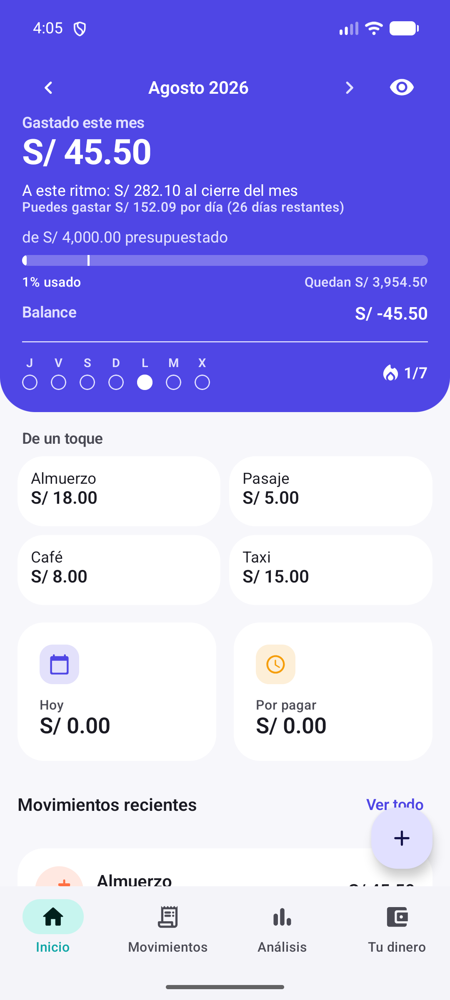
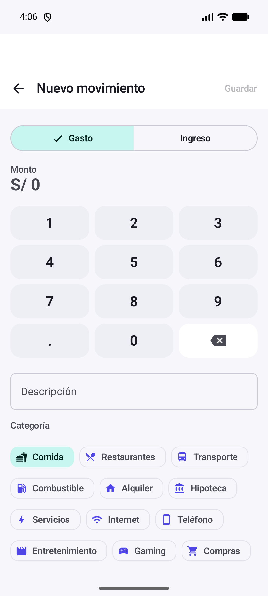
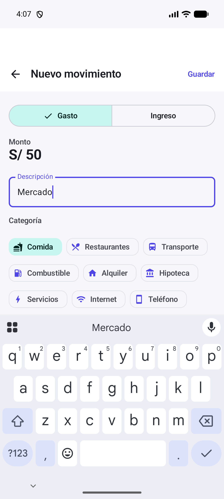
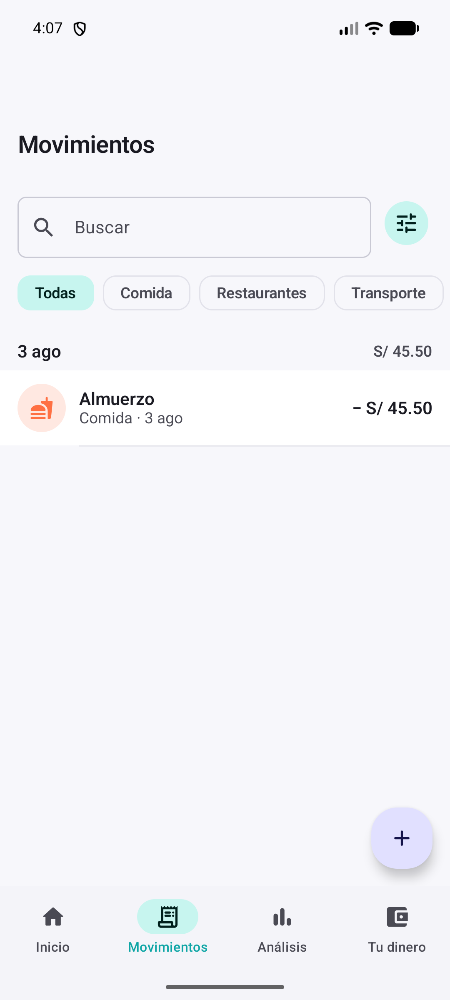
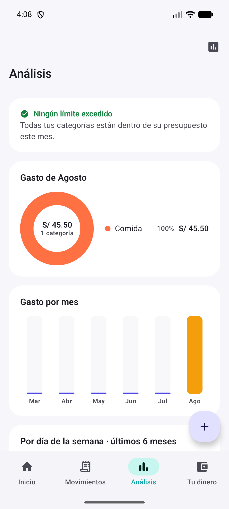
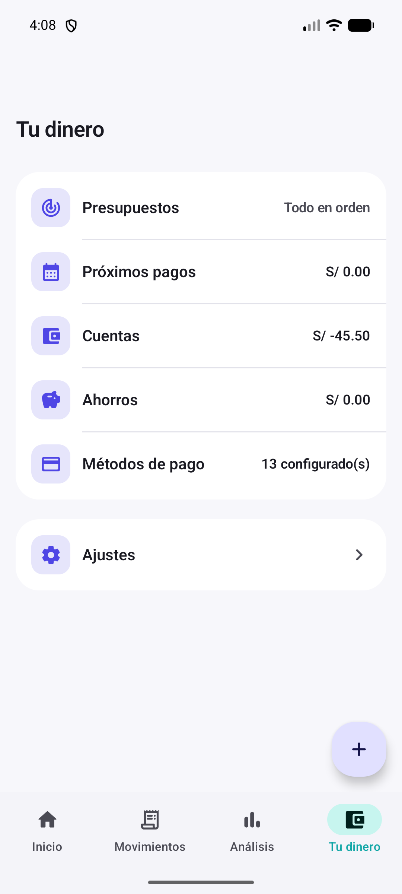

# MoneyFlow design audit — 2026-08-04

## Audit scope

- Surface: current Android debug build on a Pixel 7 emulator.
- Primary user goal: understand the month at a glance, record an expense quickly, find a movement, and decide what to do next.
- Accessibility target: WCAG-informed mobile usability review. Screenshot evidence can identify risks, but cannot prove full compliance.
- Evidence: fresh screenshots in `docs/audit-2026-08-04-evidence/`.

## Overall score

**7.1/10 — solid product structure, uneven decision hierarchy.**

| Area | Score | Assessment |
|---|---:|---|
| Navigation and information architecture | 8.5 | Four destinations are memorable and task-oriented. |
| Core expense entry | 8.0 | Immediate keypad and clear expense/income choice reduce friction. |
| Home hierarchy | 6.5 | Useful data, but the hero is dense and pushes recent activity below the fold. |
| Movements | 8.0 | Search, filters, totals, and rows are easy to scan. |
| Analytics and guidance | 6.5 | Charts are clear, but the screen is more descriptive than actionable in the healthy state. |
| Visual system and consistency | 7.0 | Cohesive palette and components; spacing, icon-only actions, and value alignment need refinement. |
| Accessibility risk | 6.5 | Touch targets appear generous, but icon naming, chart semantics, contrast, keyboard, and large-text behavior need device testing. |

## Flow review

### 1. Home — health: needs prioritization

Strengths: the month, total spent, budget, projection, remaining daily allowance, discreet-mode control, shortcuts, and bottom navigation are visible and coherent. The four quick expenses are genuinely useful.

Risks: the hero asks the user to interpret five related numbers at once. “Balance S/ -45.50” is ambiguous because it can be read as account balance, cash flow, or variance. The seven-day streak is visually prominent but its user benefit is not explained. “Hoy” and “Por pagar” consume large cards for zero values, while recent movements are mostly hidden below the fold.

Recommendation: make one number primary (“Disponible este mes”), one supporting status (“S/ 152 por día”), and one expandable explanation. Rename Balance to “Ingresos − gastos” or remove it from the hero. Compress zero-state cards into a single status row and surface recent activity sooner.

### 2. New movement — health: good

Strengths: amount entry is immediate, the custom keypad is large, the expense/income segmented control is clear, and disabled Save is visibly disabled. Category selection is direct rather than hidden in a second screen.

Risks: the initial screen shows many categories at once, making the page long and visually busy. It is not obvious whether “Comida” is a default, a recommendation, or the user’s last choice. Payment method and date are below the initial viewport, so users cannot anticipate the full form.

Recommendation: label suggested/default behavior (“Sugerida”) and show 4–6 recent categories plus “Ver todas.” Keep the default payment method visible in a compact summary row above the fold.

### 3. Filled movement — health: good with keyboard friction

Strengths: the Save action activates immediately, the amount remains visible, and “Mercado” correctly retains the food category. The system keyboard preserves familiar text entry behavior.

Risks: the system keyboard covers the lower form and the custom numeric keypad disappears, creating a substantial layout shift. The user cannot see payment method/date while typing. There is no visible confirmation that category selection was inferred from the description rather than merely preselected.

Recommendation: after entering the description, show a small inline message such as “Categoría sugerida: Comida” with an easy undo/change action. Keep a compact form summary above the keyboard and make Save reachable as a sticky action.

### 4. Movements — health: strong

Strengths: fixed search, category filters, date grouping, daily total, recognizable category icon, and signed amount form a strong scan pattern. The filter control is adjacent to search and the FAB is consistent.

Risks: the sliders icon is unlabeled and its difference from the visible category chips is unclear. With one result, the page looks unfinished because of the large empty area. Horizontal chips may truncate or require undiscoverable scrolling with more categories or larger text.

Recommendation: name the action “Filtros” or provide a visible label; use it for date, amount, type, account, and payment method while chips remain quick category shortcuts. Add an informative empty/low-data state that suggests importing or adding another movement.

### 5. Analytics — health: informative, not yet decision-led

Strengths: the healthy budget message is reassuring, the donut’s center total is easy to understand, and the monthly chart uses a simple visual vocabulary.

Risks: “Ningún límite excedido” is a dead end; it confirms status but offers no next action. A 100% single-category donut adds little information. The small icon in the top-right has no visible label. Chart bars and labels must expose accessible names and values; screenshots cannot verify this.

Recommendation: replace low-information charts with a useful healthy-state insight such as “Vas S/ X por debajo de tu ritmo” and a CTA (“Revisar presupuesto” or “Ver gastos de Comida”). Hide or simplify charts when the dataset has only one category or one active month.

### 6. Your Money — health: clear structure, polish issues

Strengths: the page groups financial destinations in plain language and places live values on each row. Settings is separated from money management.

Risks: “Cuentas S/ -45.50” visually runs together because the label and value are too close. “13 configurado(s)” exposes implementation-style pluralization and suggests excessive defaults. “Todo en orden” is less informative than the other numeric summaries. Rows lack consistent trailing affordances even though they navigate.

Recommendation: enforce a stable label/value grid with right-aligned values; use correct Spanish pluralization (“13 configurados”); show a useful budget summary (“0 en riesgo”); use consistent chevrons or make the whole row’s navigability clearer.

## Highest-impact plan

### Phase 1 — clarity and trust (1–2 sprints)

1. Simplify the home hero to one primary balance/status and two supporting facts.
2. Rename or remove ambiguous “Balance.”
3. Fix Your Money alignment and pluralization; standardize row affordances.
4. Give all icon-only actions visible labels or unambiguous accessibility names.

Success measures: first-glance comprehension test ≥80%; “What can I spend?” answered in under 5 seconds; navigation label comprehension ≥90%.

### Phase 2 — faster entry and retrieval (1 sprint)

1. Add “recent/suggested” category behavior and reduce the initial category wall.
2. Keep payment method/date summary visible while entering description.
3. Clarify quick chips versus advanced filters on Movements.
4. Add useful low-data and empty states.

Success measures: median expense entry under 10 seconds; fewer than two category changes per ten entries; filtered movement found in under 15 seconds.

### Phase 3 — decision-led analytics (1–2 sprints)

1. Design healthy, warning, and exceeded states around a recommended next action.
2. Suppress charts that do not add information with sparse data.
3. Add direct links from insights to filtered movements and budget editing.
4. Validate chart labels and reading order with TalkBack.

Success measures: ≥60% of analytics visits produce a meaningful follow-up action; users can explain the key insight without interpreting the chart legend.

### Phase 4 — accessibility and resilience (continuous, first pass in 1 sprint)

1. Verify contrast, touch targets, TalkBack labels/order, keyboard focus, and state announcements.
2. Test 200% font scale and narrow screens for chip wrapping, clipped values, and sticky actions.
3. Test discreet mode across every amount, chart, widget, and accessibility label.
4. Validate destructive actions, undo timing, error recovery, and bank-app return flow on a real device.

## Evidence limits

- The audit used the current emulator build and fresh screenshots, not user research sessions.
- Screenshots cannot verify color contrast ratios, TalkBack output, keyboard traversal, haptics, motion, state announcements, or real-device bank-app handoff.
- Onboarding, payment, error, empty, dark-mode, tablet, and extreme font-scale states were not included in this pass.
