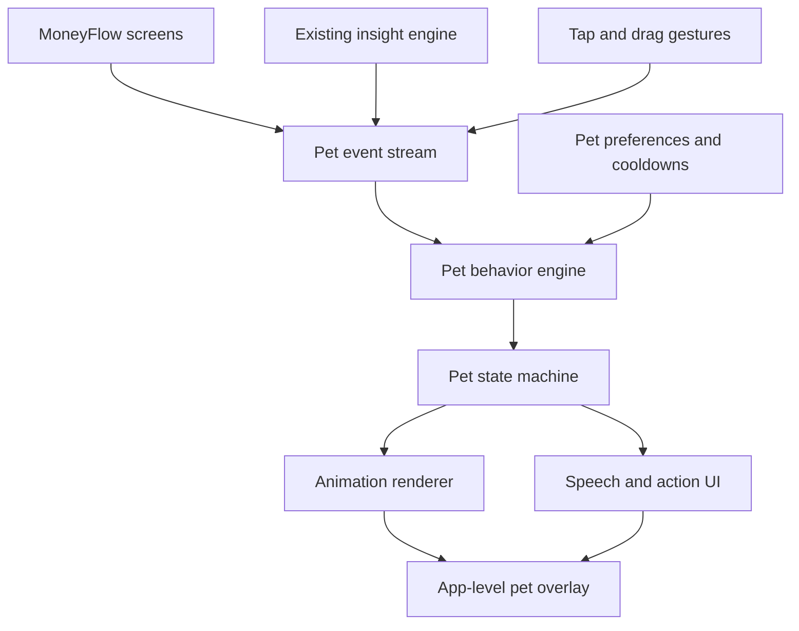

# MoneyFlow Interactive Pet Companion Plan

## 1. Executive summary

MoneyFlow will add an optional interactive pet inspired by desktop assistants such as Microsoft Office's Clippy. The pet will live inside the MoneyFlow application, react to touch and meaningful financial events, and offer short contextual guidance without interrupting the user's primary tasks.

The recommended implementation is an app-level companion backed by a deterministic behavior engine and an animation state machine. It should remain separate from individual screens so it can survive navigation, preserve its state, and evolve independently from the finance features.

**Overall difficulty:** 7/10  
**Functional prototype:** 1–2 weeks  
**Good first release:** 3–4 weeks  
**Highly polished release:** 5–7 weeks  
**Target animation quality:** 8–9/10 with purpose-built, state-machine-ready character assets

## 2. Product goals

The companion should:

- Make MoneyFlow feel warmer, more memorable, and more personal.
- React to user actions in ways that communicate system state or reinforce progress.
- Help users discover relevant features without behaving like an intrusive tutorial.
- Support light play through tapping, dragging, petting, and idle behavior.
- Remain optional, quiet, private, and respectful of sensitive financial situations.
- Work fully offline in the first release, consistent with MoneyFlow's architecture.

## 3. Non-goals for the first release

- Displaying the pet over other Android applications.
- Using a generative AI service to decide every response.
- Providing regulated financial advice.
- Gamifying spending or encouraging unnecessary transactions.
- Building multiple pets before the core interaction model is validated.
- Creating a large progression, currency, rewards, or virtual-item economy.

An Android system-wide overlay would require special permission and introduce security, trust, accessibility, and store-policy concerns. The initial companion should remain inside MoneyFlow.

## 4. Experience principles

### 4.1 Companion, not notification

The pet should feel present without constantly demanding attention. Most of its life should consist of quiet ambient animation. Speech and larger reactions should be comparatively rare.

### 4.2 Support without judgment

The pet must never shame users for overspending, low balances, missed payments, debt, or irregular income. Its language should be neutral and action-oriented.

Examples:

- Prefer: “Tu presupuesto está cerca del límite. ¿Quieres revisarlo?”
- Avoid: “¡Gastaste demasiado otra vez!”

### 4.3 Motion must communicate truth

Financial values must not appear to bounce, overshoot, or change inaccurately. Expressive motion belongs to the character; numeric indicators continue using MoneyFlow's overshoot-free progress motion.

### 4.4 Privacy first

- The pet must honor discreet mode.
- Speech should avoid exposing amounts when values are hidden.
- It must disappear on the lock screen and during sensitive authentication.
- It should not appear while another financial application is open.
- The first release should require no network connection.

### 4.5 Easy to silence

Users must be able to:

- Disable the pet completely.
- Reduce or disable speech.
- Disable sound independently.
- Enable reduced motion.
- Dismiss a message immediately.
- Move the pet away from important content.

## 5. Core interaction model

### 5.1 Ambient behavior

- Blink and breathe.
- Look around or toward nearby interface elements.
- Sit, stretch, yawn, or sleep after inactivity.
- Change pose without speaking.
- Occasionally move to another safe position.
- Wake when the user returns to the app.

### 5.2 Direct interaction

- Tap: short acknowledgment or expression.
- Double tap: alternate reaction.
- Repeated taps: playful but bounded reaction.
- Drag: follow the pointer and display a held pose.
- Release: settle or bounce gently into a valid safe position.
- Petting gesture: positive reaction if validated as discoverable and accessible.
- Speech bubble tap: perform an offered action.
- Dismiss: close the bubble and start an appropriate cooldown.
- Long press: open a compact companion menu.

### 5.3 Contextual behavior

Initial high-value events:

1. First app visit after enabling the pet.
2. Expense or income saved.
3. Budget reaches a meaningful threshold.
4. Savings goal is completed.
5. Upcoming or overdue payment needs attention.
6. An empty or low-data screen has a useful next action.

Potential later events:

- Recurring payment created.
- Backup successfully completed.
- User reaches a consistency milestone.
- New insight becomes available.
- User repeatedly visits a screen without completing its primary action.

## 6. Behavioral states

The initial state machine should support:

| State | Purpose |
|---|---|
| Hidden | Pet is disabled or the current context is sensitive. |
| Entering | Pet appears when the app or feature becomes available. |
| Idle | Default quiet state with subtle variation. |
| Walking | Pet moves between safe screen positions. |
| Noticing | Pet has detected something relevant but has not spoken. |
| Speaking | Speech bubble is visible and may contain an action. |
| Celebrating | A rare, high-emphasis positive reaction. |
| Thoughtful | Neutral response to a budget or upcoming-payment concern. |
| Sleeping | Low-power visual state after inactivity. |
| Dragged | User is actively repositioning the pet. |
| Settling | Pet returns to a valid anchored position after movement. |
| Dismissing | Pet or speech exits cleanly. |

Transitions must be interruptible. Dragging, disabling the feature, locking the app, or opening a sensitive surface should immediately override lower-priority animation.

## 7. Proposed architecture

### 7.1 Module structure

Create a dedicated `feature:pet` module with one-way dependencies consistent with the existing architecture.

```text
:app
  └── :feature:pet
        ├── :core:model
        ├── :core:domain
        ├── :core:designsystem
        └── :core:ui (only where shared UI behavior is appropriate)
```

Do not introduce dependencies from other feature modules into `feature:pet`. Finance features should publish neutral events through an app-owned interface or shared core contract.

### 7.2 Main components

#### `PetOverlayHost`

- Rendered once above the app's navigation content.
- Keeps one pet instance alive across screen transitions.
- Calculates safe placement around system bars, navigation, sheets, keyboard, and critical actions.
- Owns pointer input for tap, drag, and optional petting gestures.
- Removes itself from semantics when disabled or hidden.

#### `PetEvent`

A sealed event contract containing meaningful product events rather than screen-specific callbacks.

Examples:

```kotlin
sealed interface PetEvent {
    data object AppOpened : PetEvent
    data class TransactionSaved(val type: TransactionType) : PetEvent
    data class BudgetThresholdReached(val threshold: Int) : PetEvent
    data object SavingsGoalCompleted : PetEvent
    data class UpcomingPaymentNeedsAttention(val overdue: Boolean) : PetEvent
    data class DestinationVisited(val destination: PetDestination) : PetEvent
}
```

The event should include only the minimum data needed to choose a reaction. Avoid sending formatted amounts or sensitive text into the pet system.

#### `PetBrain`

- Receives product and interaction events.
- Applies priority, eligibility, cooldown, and frequency rules.
- Selects a behavior intent rather than directly starting an animation.
- Remains deterministic and unit-testable.
- Can later sit behind a `PetBehaviorEngine` interface if an optional AI implementation is explored.

#### `PetStateMachine`

- Converts behavior intents into valid visual states.
- Handles interruptions and transition priorities.
- Prevents contradictory states such as sleeping while speaking.
- Exposes a single immutable `StateFlow<PetUiState>`.

#### `PetRenderer`

- Maps `PetUiState` to the selected animation runtime.
- Keeps animation technology out of the behavior engine.
- Allows the prototype renderer and final renderer to share the same behavioral contract.

#### `PetPlacementController`

- Stores normalized position or screen-edge anchor.
- Clamps movement to safe bounds.
- Avoids the primary action, bottom navigation, keyboard, dialogs, and sheets.
- Recalculates placement for phones, tablets, foldables, and rotation.

#### Persistence

Extend `UserPreferences` and `SettingsRepository` with pet-specific settings:

```text
petEnabled
petSpeechEnabled
petSoundEnabled
petMotionLevel
petId
petAnchor
petOnboardingComplete
```

Cooldown timestamps and behavior history should only be persisted if they improve the experience across launches. Avoid storing a detailed behavioral profile without a clear product need.

### 7.3 Event flow



## 8. Animation strategy

### 8.1 Options

| Approach | Expected quality | Strength | Limitation |
|---|---:|---|---|
| Compose-only | 6–7/10 | Native, lightweight, easy prototype | Difficult to create expressive character acting |
| Lottie-style clips | 8/10 | Strong visual fidelity for predefined sequences | Interactive transitions may feel stitched together |
| State-machine character runtime | 9/10 | Smooth blending and responsive interaction | Requires a purpose-built rig and motion-design effort |

### 8.2 Recommendation

Use Compose for:

- Pet position and drag physics.
- Speech bubbles and actions.
- Screen-edge constraints.
- Entry and exit of the overlay.
- Accessibility semantics.
- Theme integration.

Use a state-machine-ready character asset for:

- Body movement.
- Blinking and facial expressions.
- Looking toward touches or interface targets.
- Walking and turning.
- Seamless transitions between emotional states.

The renderer should be replaceable. The technical prototype can start with simple temporary artwork, while final character production proceeds without blocking architecture work.

### 8.3 Initial animation inventory

The first polished character should include approximately 12–18 animations:

1. Idle breathing.
2. Alternate idle/look-around.
3. Blink and expression variations.
4. Walk left.
5. Walk right.
6. Turn.
7. Enter.
8. Exit.
9. Tap reaction.
10. Repeated-tap reaction.
11. Dragged/held pose.
12. Release and settle.
13. Speak/listen loop.
14. Celebrate.
15. Thoughtful/concerned.
16. Point or indicate.
17. Sleep.
18. Wake.

### 8.4 Performance target

- Maintain smooth animation at the device refresh rate, targeting stable 60 fps on representative mid-range hardware.
- Pause unnecessary animation when the app is backgrounded.
- Prefer event-driven updates over permanent high-frequency recomposition.
- Profile CPU, memory, rendering time, and battery impact on a real device.
- Degrade gracefully under reduced-motion settings.

## 9. Speech and content system

Speech should be authored as structured content, not concatenated UI strings.

Each message should define:

- Stable identifier.
- Eligibility conditions.
- Tone category.
- Cooldown.
- Maximum frequency.
- Discreet-mode variant.
- Optional action label and destination.
- Accessibility description.

Example content model:

```kotlin
data class PetMessage(
    val id: String,
    val text: String,
    val discreetText: String? = null,
    val action: PetAction? = null,
    val cooldown: Duration,
)
```

Copy should initially be Spanish to match the application. Product and content review must cover financial sensitivity, clarity, repetition, and regional tone.

## 10. Frequency and interruption rules

Suggested initial limits:

- Never show more than one speech bubble at a time.
- Never interrupt data entry, PIN entry, dialogs, payment launch, or destructive confirmation.
- Do not speak immediately after every transaction.
- Limit unsolicited speech to a small daily maximum.
- Apply event-specific cooldowns.
- Reserve celebration for meaningful milestones.
- Treat repeated dismissal as a signal to reduce frequency.
- Do not move across the screen while the user is actively reading or entering data.

Priority order:

1. Privacy and security state.
2. Direct user interaction.
3. Critical product state.
4. Requested contextual help.
5. Celebration.
6. Ambient behavior.

## 11. Placement and collision rules

The pet must not obscure:

- The main “Nuevo gasto” action.
- Bottom navigation destinations.
- Save, confirm, pay, or destructive actions.
- Amount entry and the on-screen keyboard.
- Snackbar actions.
- Dialog controls.
- Important chart labels or financial values.

Recommended behavior:

- Default to a lower screen corner above navigation.
- Store an edge anchor rather than an absolute pixel position.
- Move automatically only between precomputed safe zones.
- Temporarily hide or relocate when no safe zone exists.
- Allow manual repositioning while preserving accessibility.

## 12. Settings and onboarding

Pet controls should be grouped into a dedicated settings destination because they contain multiple meaningful controls and therefore satisfy MoneyFlow's existing navigation rule for settings screens.

Proposed controls:

- Enable companion.
- Choose pet, when more than one exists.
- Speech frequency: normal, low, or silent.
- Sound on/off.
- Motion: full, reduced, or system preference.
- Reset position.
- Replay introduction.

Onboarding should:

1. Introduce the pet briefly.
2. Demonstrate tapping and dragging.
3. Explain that suggestions are optional.
4. Show where to disable or quiet it.
5. Avoid blocking the existing finance onboarding flow.

## 13. Accessibility requirements

- Respect Android's relevant reduced-motion and animation settings where available.
- Offer an explicit reduced-motion mode inside the app.
- Maintain at least a 48 dp interactive touch target without making the visible character oversized.
- Provide concise TalkBack labels for the pet, bubble, dismiss action, and suggested action.
- Avoid endless announcements caused by idle state changes.
- Ensure the pet does not trap focus or reorder the main screen unexpectedly.
- Support 200% font scale for speech bubbles.
- Ensure sufficient light- and dark-theme contrast.
- Provide a complete disable option.

## 14. Delivery phases

### Phase 1 — Character and behavior specification

**Estimate:** 2–3 working days

Deliverables:

- Character personality and voice.
- Three visual directions.
- Emotional-state inventory.
- Interaction vocabulary.
- Financial language guardrails.
- Initial response and cooldown matrix.

Exit criteria:

- One visual direction is selected.
- The core state and animation inventory is approved.
- The pet's role and boundaries are unambiguous.

### Phase 2 — Technical prototype

**Estimate:** 4–6 working days

Deliverables:

- `feature:pet` module.
- App-level overlay host.
- Temporary pet renderer.
- Tap and drag interactions.
- Safe-edge placement.
- Basic idle and speech states.
- Enable/disable setting.
- Navigation and process-restoration behavior.

Exit criteria:

- One pet survives navigation without state corruption.
- It never blocks critical controls in the tested core flow.
- It can be disabled and remains disabled after relaunch.

### Phase 3 — Behavior engine

**Estimate:** 4–7 working days

Deliverables:

- Typed event stream.
- Behavior rules and priorities.
- Cooldowns and frequency limits.
- Interruptible state machine.
- Unit tests for decision logic.
- Initial integration with existing insights.

Exit criteria:

- Reactions are deterministic and testable.
- Sensitive contexts always override other behavior.
- Repeated events do not produce spam.

### Phase 4 — Final character production

**Estimate:** 1–3 weeks, depending on art resources

Deliverables:

- Final character model or rig.
- Core animation inventory.
- Light- and dark-theme treatment.
- Animation-state integration.
- Touch-following and directional behavior where supported.

Exit criteria:

- State transitions appear continuous.
- No obvious visual popping, clipping, or incorrect anchoring.
- Representative mid-range hardware meets the performance target.

### Phase 5 — Product integration

**Estimate:** 4–7 working days

Deliverables:

- Five or six high-value financial events.
- Actionable speech bubbles.
- Pet settings screen.
- Introduction flow.
- Discreet-mode handling.
- Analytics hooks for local QA if appropriate, without collecting financial data.

Exit criteria:

- Every reaction has a clear product purpose.
- Copy has been reviewed for tone and financial sensitivity.
- The pet remains quiet during focused workflows.

### Phase 6 — QA and tuning

**Estimate:** 4–6 working days

Test matrix:

- Small phone, Pixel-class phone, tablet, and foldable layout.
- Light and dark themes.
- Portrait, landscape, and process restoration.
- Bottom sheets, dialogs, snackbar, keyboard, and navigation transitions.
- App lock and discreet mode.
- TalkBack and 200% font scale.
- Reduced motion.
- Battery and rendering performance.
- Repeated events and extended idle sessions.

Exit criteria:

- No critical-control obstruction.
- No financial information leaks through speech.
- No animation or behavior loop survives a state where it should be hidden.
- Accessibility checks and regression tests pass.

## 15. Effort scenarios

| Scope | Estimate | Result |
|---|---:|---|
| Architecture prototype | 1–2 weeks | One temporary pet, drag/tap, basic idle and speech |
| First production release | 3–4 weeks | Polished core pet with selected contextual reactions |
| High-polish release | 5–7 weeks | Strong character rig, seamless transitions, extensive QA |
| Companion platform | 8–12 weeks | Multiple pets, customization, progression, expanded behaviors |

Estimates assume one experienced Android engineer with access to a motion designer. Without a dedicated motion designer, architecture and interactions remain achievable, but final animation production may take longer and require more iteration.

## 16. Key risks and mitigations

| Risk | Impact | Mitigation |
|---|---|---|
| Pet becomes annoying | Users disable the feature | Strict cooldowns, daily limits, dismissal learning, silent mode |
| Pet blocks controls | Core finance tasks become harder | Safe-zone placement, collision rules, automatic hiding |
| Animation assets feel disconnected | Character feels like separate clips | Use a shared rig and state-machine transitions |
| Performance or battery regression | Poor experience on mid-range devices | Profile early, pause offscreen work, limit recomposition |
| Sensitive or judgmental language | Loss of trust | Content rules, reviewed copy, neutral financial framing |
| Amount leakage in discreet mode | Privacy defect | Structured messages, discreet variants, automated tests |
| Feature logic leaks into every screen | Maintenance cost | Typed event boundary and isolated `feature:pet` module |
| Scope expands into a game system | Delayed release | Validate one pet and six events before customization work |
| External overlay requested later | Security and policy complexity | Keep renderer in-app; assess overlays as a separate project |

## 17. Testing strategy

### Unit tests

- Event eligibility.
- Priority resolution.
- Cooldown behavior.
- Frequency limits.
- State transition validity.
- Sensitive-context overrides.
- Discreet-mode copy selection.
- Placement calculations.

### Compose UI tests

- Enable and disable persistence.
- Tap, drag, release, and dismiss.
- Pet survives navigation.
- Pet hides on lock and sensitive screens.
- Speech action navigates correctly.
- No overlap with known critical controls.
- TalkBack semantics.
- Large-font speech layout.

### Performance tests

- Frame timing during idle and active animation.
- CPU and memory during a long idle session.
- Battery impact during representative use.
- Recomposition counts around the overlay.
- Resume, background, and process-restoration behavior.

## 18. Release strategy

Recommended rollout:

1. Internal prototype with temporary art.
2. Team usability review focused on obstruction and interruption.
3. Final-art beta behind an opt-in setting.
4. Tune frequency and copy from qualitative feedback.
5. Public release with the pet disabled by default or introduced through explicit opt-in.
6. Evaluate demand before adding additional pets or progression.

The pet should be feature-flagged during development so it cannot accidentally ship before content, accessibility, privacy, and performance validation are complete.

## 19. Definition of done for version 1

Version 1 is complete when:

- The user can explicitly enable and disable the companion.
- One production-quality pet is available.
- Tap, drag, idle, speech, sleep, and celebration behaviors work.
- The pet responds to no more than six carefully selected financial events.
- Cooldowns and frequency caps prevent repetitive interruptions.
- The pet honors discreet mode and all sensitive app states.
- The pet does not obscure critical actions across supported layouts.
- Motion and speech have accessible alternatives.
- Unit, Compose UI, accessibility, and performance checks pass.
- The feature operates offline.
- The existing finance workflows remain unchanged when the pet is disabled.

## 20. Recommended immediate next step

Create a short character brief and produce exactly three visual directions. Select one direction before choosing the final animation runtime or beginning production character rigging.

## 21. Current character direction

The selected direction is the warm pocket-animal family, refined into a small companion family:

- **Beaver:** the primary MoneyFlow companion. It should be unmistakably beaver-like, with a broad flat tail, rounded ears, prominent front teeth, compact paws, and a calm woodland personality.
- **Weather companion:** a small rounded cloud-and-leaf companion whose form communicates mood: storm cloud with rain and lightning when angry, sun breaking through when happy, soft gray cloud when sad, and a swirling miniature hurricane when hasty or restless.
- **Calico angora cat:** a fluffy, elegant companion with long soft fur, pointed tufted ears, expressive feline eyes, and a large plume-like tail. Its coat uses irregular warm orange, deep charcoal/black, and white patches so its silhouette and palette are immediately distinct from the Samoyed.
- **Samoyed puppy:** a friendly white, fluffy puppy with small triangular ears, cream shading, and a curled plume tail.

All four should share:

- The same deep-indigo clothing/accessory language.
- A shared accessory language with deliberately different character palettes.
- Consistent eye and facial-expression language.
- Separable limbs and clear silhouettes for one shared 2D animation system.

The pets should not share one generic animation set. They share the behavior contract, but each character gets signature movement:

- **Beaver:** tail thump, cheeky toothy grin, wood-chopping pantomime, belly rest, and slow sleepy curl.
- **Calico angora cat:** elegant stretch, tail plume swish, ear flick, grooming, graceful pounce, and curled fluffy-ball sleep.
- **Samoyed puppy:** happy bounce, play bow, head tilt, paw wave, excited tail wag, and puppy flop.
- **Weather companion:** hover bob, cloud puff, rain release, lightning flash, wind spiral, and cloud-to-sun transformation.

All pets still support shared interaction intents such as tap, drag, speak, dismiss, and settle, but the visual response is character-specific.

The weather companion adds a mood-state layer rather than a separate personality system:

| Pet mood | Weather form |
|---|---|
| Angry or urgent | Dark storm cloud, rain, and small lightning accents |
| Happy or celebrating | Bright sun peeking through the cloud |
| Sad or reflective | Soft gray cloud with gentle drizzle |
| Hasty or restless | Compact swirling hurricane/tornado form |

The weather companion must remain airborne during normal behavior. A soft elliptical shadow may appear below it to communicate height, but it must never sit on a pot, bed, platform, or floor object. The happy state is a real transformation: the cloud thins and disperses, then the sun emerges from it; it is not a separate static character swap.

## 22. Deferred character animation backlog

These ideas are intentionally deferred until the base interaction system and tone are validated. They should be designed as character-specific animations rather than generic reactions shared by every pet.

### Beaver-specific

- Woodworking: gathers small pieces of wood and builds a tiny useful object.
- Construction progress: adds a piece to a small project after a positive savings or consistency milestone.
- Satisfied inspection: steps back, checks the work, and gives a proud nod.

### Contextual financial reactions

- Overspending concern: a gentle disappointed or worried reaction when spending is materially above the user's budget or normal plan.
- Recovery/support: returns to a constructive posture and points toward a useful next action.
- Positive correction: celebrates when the user adjusts course, rather than celebrating spending itself.

These reactions must never shame the user or imply moral judgment. “Disappointed” should read as caring concern about the situation, not disappointment in the person. The behavior should be based on meaningful thresholds and cooldowns, not on every individual transaction.

### Relationship reactions

- Chase-away response: a brief sad reaction when the user dismisses or sends the pet away.
- Respectful retreat: the pet leaves promptly and does not immediately reappear.
- Return welcome: a quiet, non-guilt-inducing greeting when the user enables or invites the pet back.

The chase-away reaction should remain short and optional. It must not punish dismissal, block navigation, or create emotional pressure to keep the companion enabled.

### Design rule for future reactions

Every special animation should answer at least one of these questions before production:

1. What product state does it communicate?
2. What feeling should it create?
3. Why is this character uniquely suited to the reaction?
4. What is the cooldown and opt-out behavior?

## 23. Design assets and handoff

The approved visual reference is stored in the repository so future chats and computers do not depend on the Codex image cache:

- [Current family direction — calico angora, Samoyed, beaver, and floating weather companion](pet-companion-assets/pet-family-v3-calico-samoyed-weather.png)
- [Previous family direction](pet-companion-assets/pet-family-v2.png)

### Current decisions

- Default pet: beaver.
- Companion family: beaver, calico angora cat, white Samoyed puppy, and floating weather companion.
- Rendering direction: 2D rigged character animation with 3D-style depth, shadows, particles, and transitions.
- Weather companion: airborne with a soft shadow; cloud-to-sun is an animated transformation.
- Animation direction: each pet gets its own signature animations; shared interaction intents do not imply identical motion.
- Current implementation stage: technical prototype architecture, before final production animation assets.

This document and the `docs/pet-companion-assets/` folder are the source of truth for continuing the work in a new chat.

Version 1 should ship with the beaver as the default and treat the plant, cat, and dog as selectable variants only after the base behavior system is stable. This keeps the art direction richer without multiplying the initial behavioral scope.
